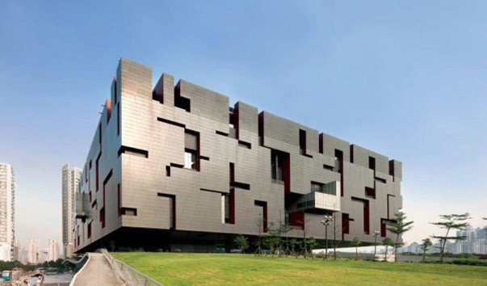
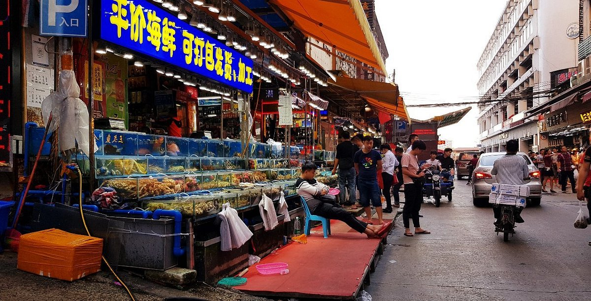

Last week, I went on an unforgettable trip to China with my family, visiting the amazing city of Guangzhou. Here I was able to enjoy the beauty of modern museums and exhibitions, which amazed me with their diversity and uniqueness of exhibits.

During my stay in Guangzhou, I visited the Museum of Science and Technology, where I learned a lot about the development of science and technology in China. Then I went to the Museum of Art, where I saw the works of Chinese artists and sculptors created in different periods of the country's history.

In addition to visiting museums, I also decided to walk around the city and enjoy its architecture and atmosphere. I visited Panyu Market, where I bought souvenirs for my friends and relatives, and also tasted local cuisine at one of the restaurants in the city.

In general, my last week in Guangzhou was full of vivid impressions and discoveries. I am grateful for the opportunity to visit this amazing country and get acquainted with its culture and history.

