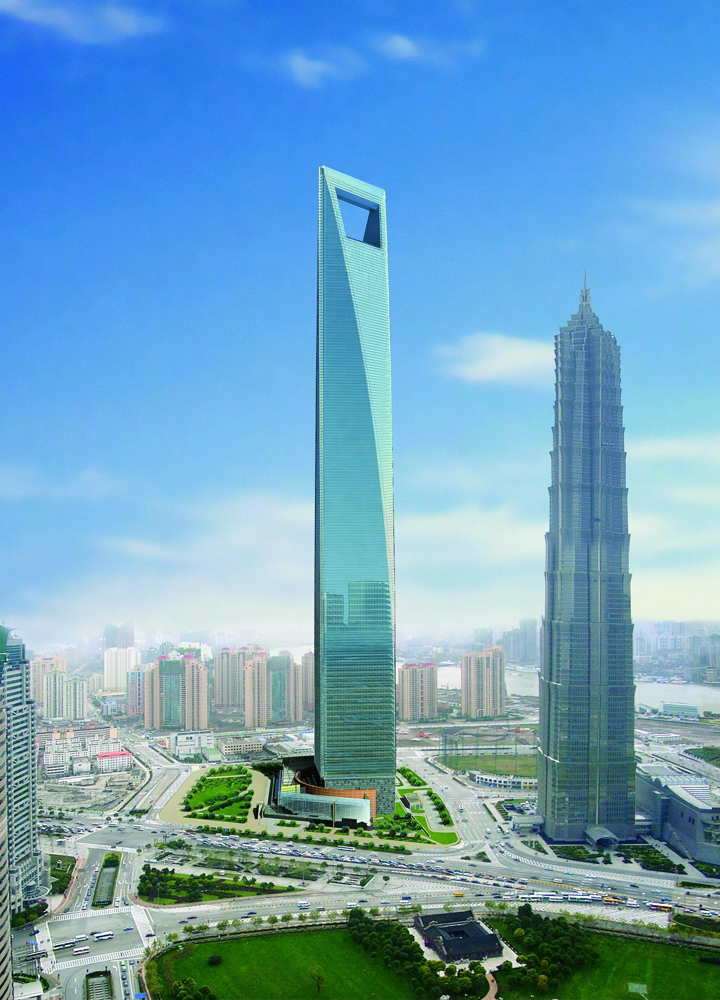

After traveling in Guangzhou, I went to Shanghai, where I spent the last week. During this time, I managed to visit many famous places in the city.

The first thing I did was go to Pudong district, which is considered the financial center of Shanghai. Here I saw the famous Shanghai World Financial Center, a 492—meter-high skyscraper that is the second tallest building in China.

I also visited the Bund, which is known for its beautiful views of the Huangpu River and skyscrapers. Then I went to Lujiazui district, which is famous for its shopping malls and offices of large companies. Here I visited the Shanghai Museum of Science and Technology, which is one of the largest science and technology museums in the world. The museum presents exhibits telling about the history of the development of science and technology, as well as about modern achievements in this field.

After the museum, I went to Yuyuan Park, which is one of the most famous parks in Shanghai. In the park, I walked along the picturesque alleys, admired the beautiful views of the lake and the surrounding mountains, and also visited the rock garden, where I could enjoy peace and quiet.
On the last day of my stay in Shanghai, I went to the Nanshi district, which is famous for its historical sites. Here I visited the Jade Buddha Temple, which is one of the most famous Buddhist temples in Shanghai. In the temple, I saw a statue of the Jade Buddha, which is considered one of the most revered statues in China.

In general, during the last week in Shanghai, I was able to get acquainted with the history, culture and modern life of the city. I saw a lot of interesting places that left unforgettable impressions.

