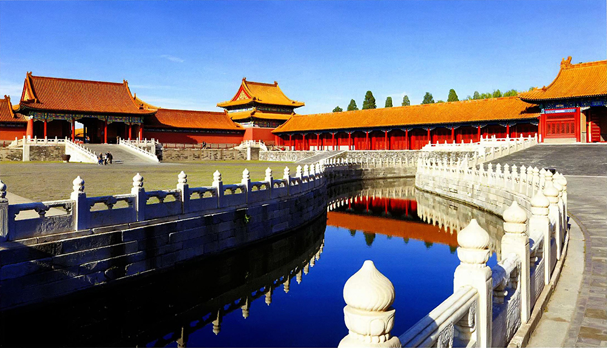
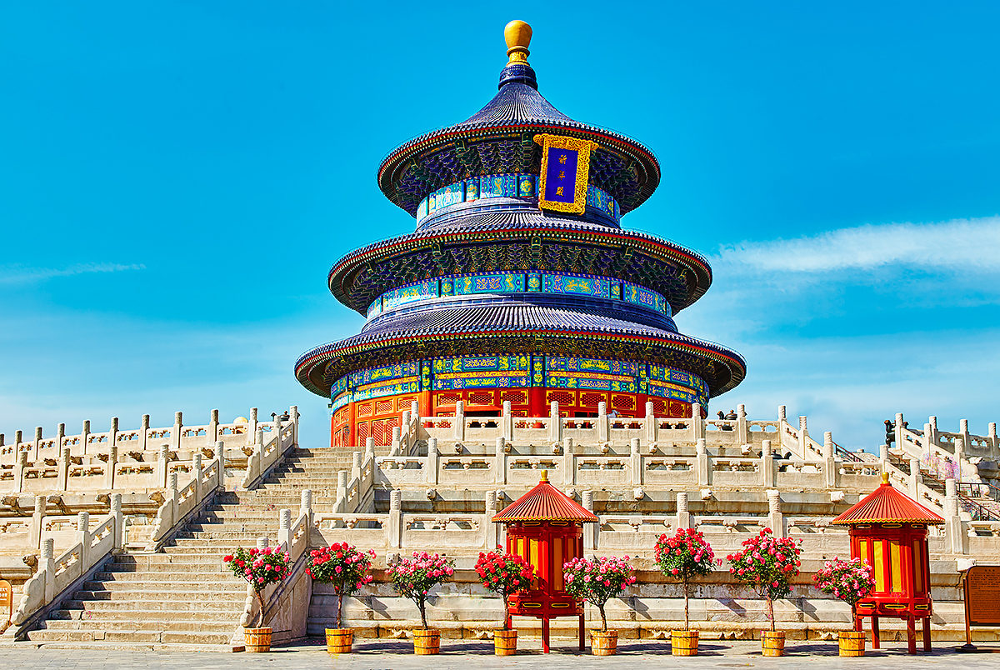
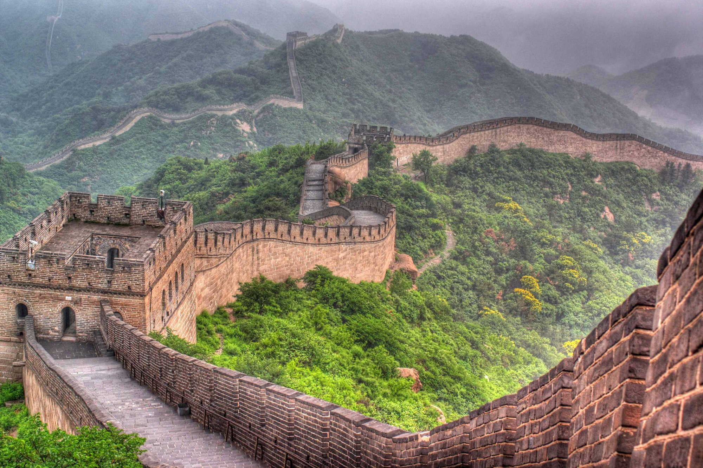

After visiting Shanghai, I went to Beijing to explore its famous sights. First of all, I decided to visit the Forbidden City, famous for its rich historical heritage and architecture. Walking through its territory, I felt the atmosphere of antiquity and the greatness of Chinese culture.

Next, I went to the Temple of Heaven, which is famous for its beauty and harmonious combination of nature and architecture. Here I watched the sky worship ceremonies that take place every year.
The next point on my route was the Summer Palace, located on the outskirts of Beijing. This park impresses with its beauty and variety of landscapes, here you can relax from the hustle and bustle of the city and enjoy nature.

I also visited the Great Wall of China, which is a symbol of the power and greatness of Chinese civilization. A walk through this grandiose structure allowed me to feel the scale and grandeur of this historical monument.

In my spare time, I explored local markets and shops, where I bought souvenirs and gifts for my loved ones.
At the end of my visit to Beijing, I visited Tiananmen Square, where the mausoleum of Mao Zedong and other important historical sites are located. Here I felt the spirit of the Chinese nation and realized how important it is to preserve and respect our history.

My trip to Beijing left an indelible impression and allowed me to delve deeper into the culture and history of China.

