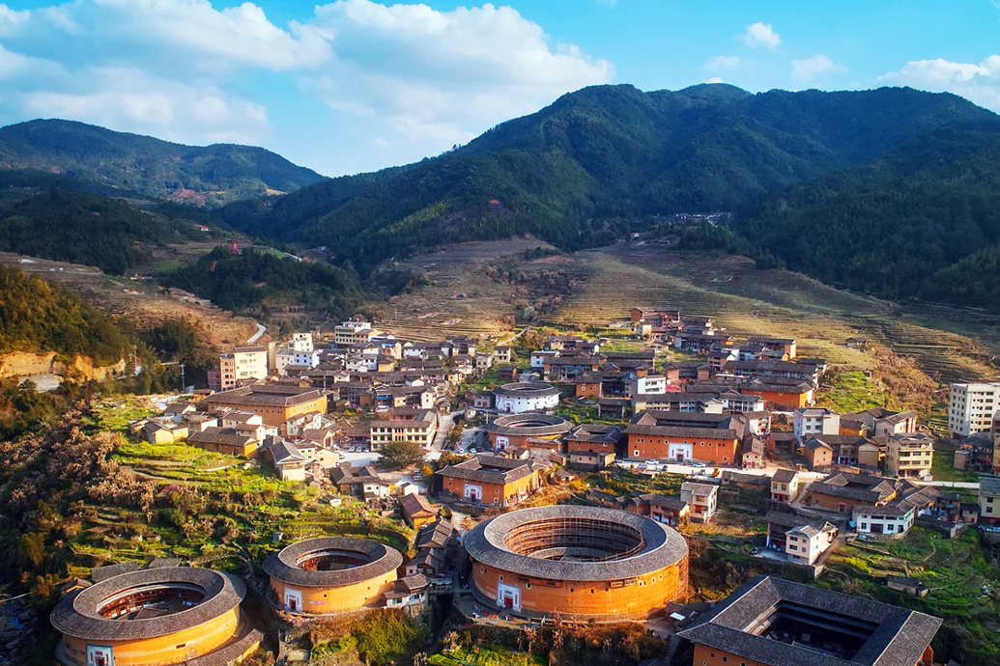
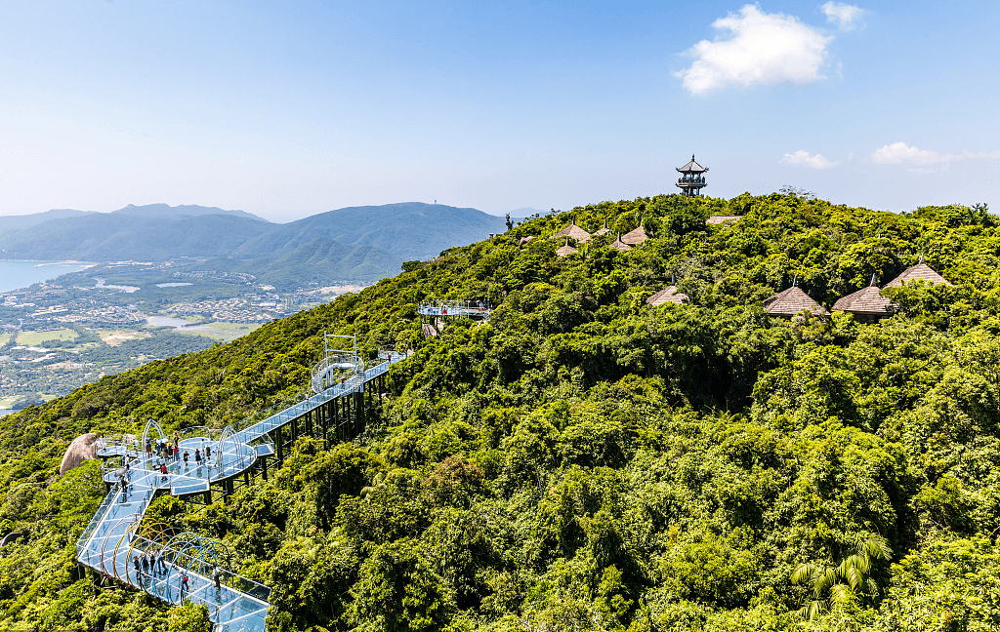
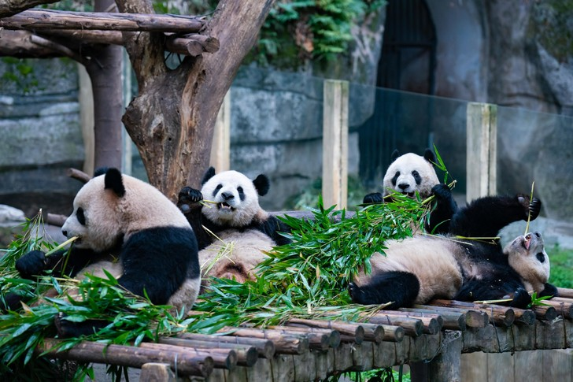

After visiting Beijing, I went to Chongqing to spend the last week of my trip there. Chongqing is a large city in western China, known for its economy, industry and attractions.
First of all, I decided to visit the old town of Longyan, which is located on the banks of the Jialing River. Here I saw many historical buildings dating back to the Ming and Qing dynasties. Craft shops and souvenir shops are also located in the area.

Next, I went for a walk through JiefanBei Park, which is the heart of the city's business and tourist life. Here I was able to enjoy the beautiful views of the city.

In the evening, I decided to take a cable car ride across the Yangtze River, which is one of the main attractions of Chongqing. From a bird's-eye view, I was able to enjoy the stunning scenery of the night city and its lights.
I also visited the Chongqing Zoo, which is one of the largest zoos in China. Here I saw a variety of animals, including pandas, which are considered a symbol of China.

In general, my last week in Chongqing was full of vivid impressions and emotions. I was able to get acquainted with the history, culture and nature of this amazing city.

