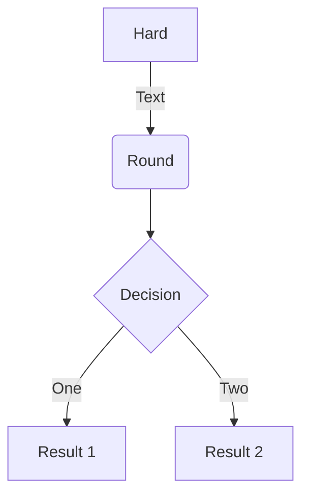
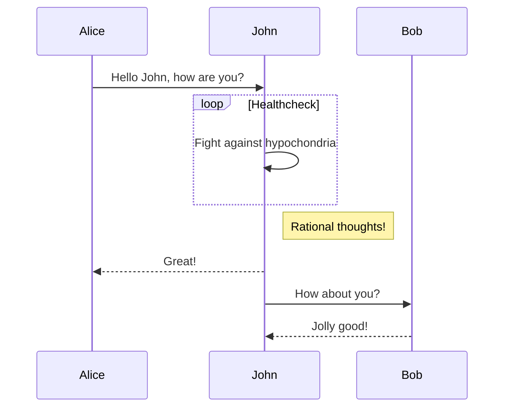
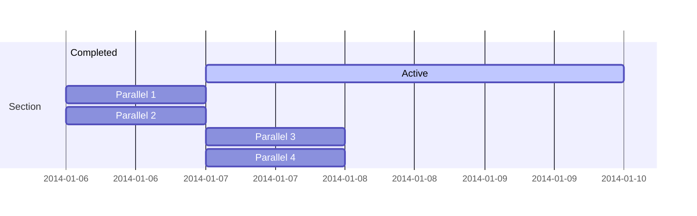
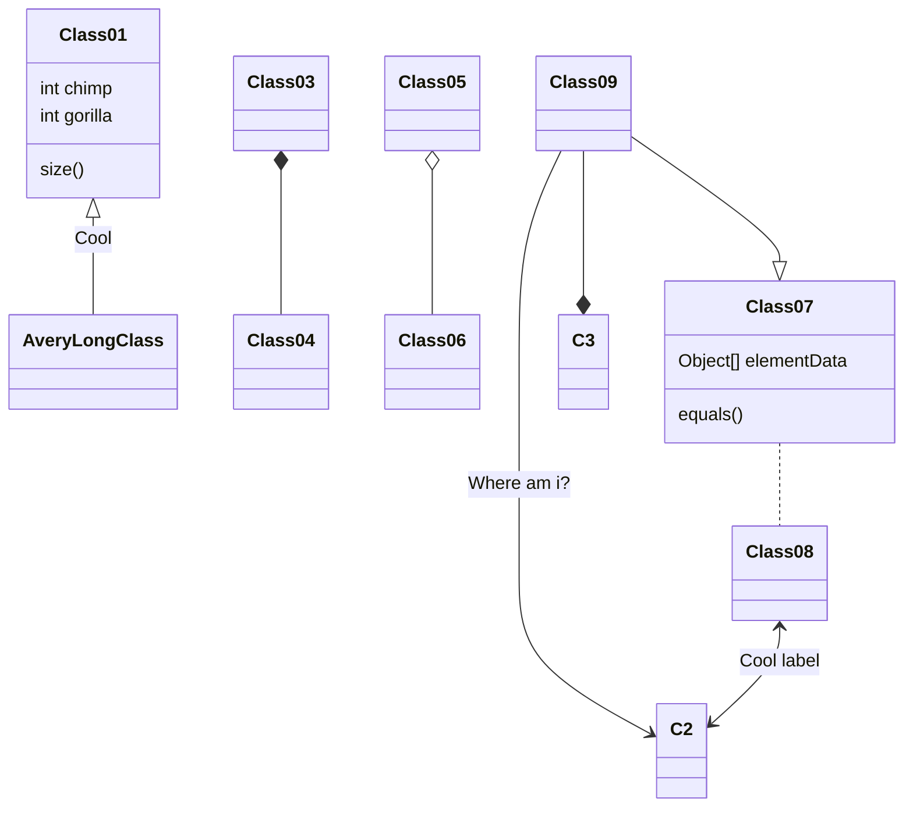
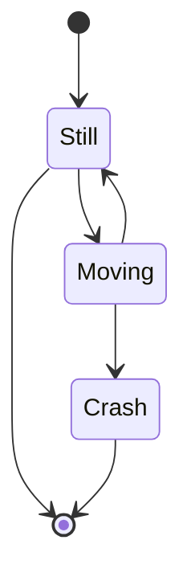

## Examples

### Code

Wowchemy поддерживает расширение Markdown для выделения синтаксиса кода. Вы можете настроить стили с помощью параметра "syntax_highlighter" в вашем файле "config/_default/params.yaml".

    ```python
    import pandas as pd
    data = pd.read_csv("data.csv")
    data.head()
    ```

визуализируется так

```python
import pandas as pd
data = pd.read_csv("data.csv")
data.head()
```

### Mindmaps

Wowchemy поддерживает расширение Markdown для mindmaps.

Просто вставьте блок кода Markdown `markmap` и при желании установите высоту mindmap, как показано в примере ниже.

A simple mindmap defined as a Markdown list:

<div class="highlight">
<pre class="chroma">
<code>
```markmap {height="200px"}
- Hugo Modules
  - wowchemy
  - blox-plugins-netlify
  - blox-plugins-netlify-cms
  - blox-plugins-reveal
```
</code>
</pre>
</div>

визуализируется так

```markmap {height="200px"}
- Hugo Modules
  - wowchemy
  - blox-plugins-netlify
  - blox-plugins-netlify-cms
  - blox-plugins-reveal
```

Более продвинутая ментальная карта с форматированием, блоками кода и математикой:

<div class="highlight">
<pre class="chroma">
<code>
```markmap
- Mindmaps
  - Links
    - [Wowchemy Docs](https://docs.hugoblox.com/)
    - [Discord Community](https://discord.gg/z8wNYzb)
    - [GitHub](https://github.com/HugoBlox/hugo-blox-builder)
  - Features
    - Markdown formatting
    - **inline** ~~text~~ *styles*
    - multiline
      text
    - `inline code`
    -
      ```js
      console.log('hello');
      console.log('code block');
      ```
    - Math: $x = {-b \pm \sqrt{b^2-4ac} \over 2a}$
```
</code>
</pre>
</div>

визуализируется так

```markmap
- Mindmaps
  - Links
    - [Wowchemy Docs](https://docs.hugoblox.com/)
    - [Discord Community](https://discord.gg/z8wNYzb)
    - [GitHub](https://github.com/HugoBlox/hugo-blox-builder)
  - Features
    - Markdown formatting
    - **inline** ~~text~~ *styles*
    - multiline
      text
    - `inline code`
    -
      ```js
      console.log('hello');
      console.log('code block');
      ```
    - Math: $x = {-b \pm \sqrt{b^2-4ac} \over 2a}$
```

### Charts

Wowchemy поддерживает популярный формат интерактивных графиков [Plotly](https://plot.ly/).

Сохраните свой графический JSON-файл в папке page, например "line-chart.json", а затем добавьте короткий код `` в том месте, где вы хотели бы видеть диаграмму.

Demo:



Возможно, вам также пригодится [Plotly JSON Editor](http://plotly-json-editor.getforge.io/) useful.

### Math

Wowchemy поддерживает расширение Markdown для  $\LaTeX$ math. Вы можете включить эту функцию, переключив параметр `math` в `config/_default/params.yaml`.

Чтобы отобразить _inline_ or _block_ math, берните математику в LaTeX с помощью `$...$` or `$$...$$`, соответственно.

Example **math block**:

```latex

$$
\gamma_{n} = \frac{ \left | \left (\mathbf x_{n} - \mathbf x_{n-1} \right )^T \left [\nabla F (\mathbf x_{n}) - \nabla F (\mathbf x_{n-1}) \right ] \right |}{\left \|\nabla F(\mathbf{x}_{n}) - \nabla F(\mathbf{x}_{n-1}) \right \|^2}
$$

```

визуализируется так


$$\gamma_{n} = \frac{ \left | \left (\mathbf x_{n} - \mathbf x_{n-1} \right )^T \left [\nabla F (\mathbf x_{n}) - \nabla F (\mathbf x_{n-1}) \right ] \right |}{\left \|\nabla F(\mathbf{x}_{n}) - \nabla F(\mathbf{x}_{n-1}) \right \|^2}$$


Example **inline math** `$\nabla F(\mathbf{x}_{n})$` renders as $\nabla F(\mathbf{x}_{n})$.

Example **multi-line math** using the math linebreak (`\\`):

```latex

$$f(k;p_{0}^{*}) = \begin{cases}p_{0}^{*} & \text{if }k=1, \\
1-p_{0}^{*} & \text{if }k=0.\end{cases}$$

```

визуализируется так



$$
f(k;p_{0}^{*}) = \begin{cases}p_{0}^{*} & \text{if }k=1, \\
1-p_{0}^{*} & \text{if }k=0.\end{cases}
$$



### Diagrams

Wowchemy поддерживает расширение Markdown для диаграмм. Вы можете включить эту функцию, переключив параметр "диаграмма" в вашем файле "config/_default/params.toml" или добавив "диаграмма: true" в заголовок вашей страницы.

An example **flowchart**:

    ```mermaid
    graph TD
    A[Hard] -->|Text| B(Round)
    B --> C{Decision}
    C -->|One| D[Result 1]
    C -->|Two| E[Result 2]
    ```

визуализируется так



An example **sequence diagram**:

    ```mermaid
    sequenceDiagram
    Alice->>John: Hello John, how are you?
    loop Healthcheck
        John->>John: Fight against hypochondria
    end
    Note right of John: Rational thoughts!
    John-->>Alice: Great!
    John->>Bob: How about you?
    Bob-->>John: Jolly good!
    ```

визуализируется так



An example **Gantt diagram**:

    ```mermaid
    gantt
    section Section
    Completed :done,    des1, 2014-01-06,2014-01-08
    Active        :active,  des2, 2014-01-07, 3d
    Parallel 1   :         des3, after des1, 1d
    Parallel 2   :         des4, after des1, 1d
    Parallel 3   :         des5, after des3, 1d
    Parallel 4   :         des6, after des4, 1d
    ```

визуализируется так



An example **class diagram**:

    ```mermaid
    classDiagram
    Class01 <|-- AveryLongClass : Cool
    Class03 *-- Class04
    Class05 o-- Class06
    Class07 .. Class08
    Class09 --> C2 : Where am i?
    Class09 --* C3
    Class09 --|> Class07
    Class07 : equals()
    Class07 : Object[] elementData
    Class01 : size()
    Class01 : int chimp
    Class01 : int gorilla
    Class08 <--> C2: Cool label
    ```

визуализируется так



An example **state diagram**:

    ```mermaid
    stateDiagram
    [*] --> Still
    Still --> [*]
    Still --> Moving
    Moving --> Still
    Moving --> Crash
    Crash --> [*]
    ```

визуализируется так



### Todo lists

Вы даже можете создавать свои списки дел в Markdown:

```markdown
- [x] Write math example
  - [x] Write diagram example
- [ ] Do something else
```

отображается так

- [x] Write math example
  - [x] Write diagram example
- [ ] Do something else

### Tables

Сохраните вашу электронную таблицу в виде CSV-файла в папке вашей страницы, а затем отрисуйте ее, добавив короткий код _Table_ на вашу страницу:

```go

```

визуализируется так


### Callouts

Academic поддерживает [shortcode for callouts](https://docs.hugoblox.com/content/writing-markdown-latex/#callouts), также называемый as _asides_, _hints_, or _alerts_. Заключая абзац в  `{} ... {}`, это будет отображаться как отступление.

```markdown
{}
A Markdown aside is useful for displaying notices, hints, or definitions to your readers.
{}
```

визуализируется так

{}
Markdown полезен для отображения уведомлений, подсказок или определений для ваших читателей.
{}

### Spoilers

Добавьте спойлер на страницу, чтобы после нажатия кнопки отображался текст, например ответ на вопрос.

```markdown

You found me!

```

визуализируется так

 You found me! 

### Icons

Academic позволяет вам использовать широкий спектр [icons from _Font Awesome_ and _Academicons_](https://docs.hugoblox.com/getting-started/page-builder/#icons) в дополнение к [emojis](https://docs.hugoblox.com/content/writing-markdown-latex/#emojis).

Вот несколько примеров использования шорткода "icon" для отображения значков:

```markdown
 Terminal  
 Python  
 R
```

визуализируется так

 Terminal  
 Python  
 R
