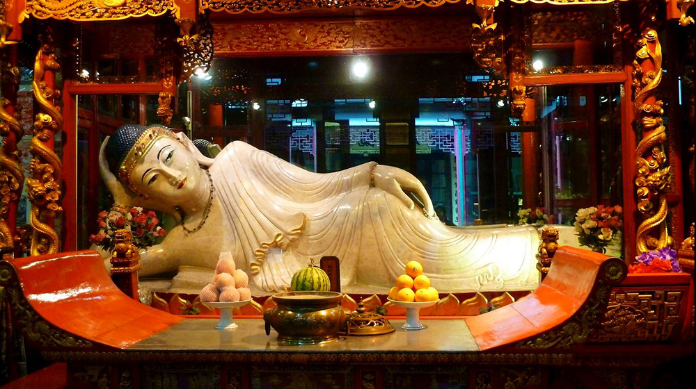

После путешествия по Гуанчжоу я отправился в Шанхай, где провёл последнюю неделю. За это время я успел посетить множество известных мест города.

Первым делом я отправился в район Пудун, который считается финансовым центром Шанхая. Здесь я увидел знаменитый Шанхайский всемирный финансовый центр — небоскрёб высотой 492 метра, который является вторым по высоте зданием в Китае. 

Также я побывал на набережной Вайтань, которая известна своими красивыми видами на реку Хуанпу и небоскрёбы. Затем я отправился в район Луцзяцзуй, который известен своими торговыми центрами и офисами крупных компаний. Здесь я посетил Шанхайский музей науки и техники, который является одним из крупнейших музеев науки и техники в мире. В музее представлены экспонаты, рассказывающие об истории развития науки и техники, а также о современных достижениях в этой области.

После музея я отправился в парк Юйюань, который является одним из самых известных парков Шанхая. В парке я прогулялся по живописным аллеям, полюбовался красивыми видами на озеро и окружающие горы, а также посетил сад камней, где можно было насладиться спокойствием и тишиной.
В последний день своего пребывания в Шанхае я отправился в район Наньши, который известен своими историческими достопримечательностями. Здесь я посетил Храм Нефритового Будды, который является одним из самых известных буддийских храмов в Шанхае. В храме я увидел статую Нефритового Будды, которая считается одной из самых почитаемых статуй в Китае.

В целом, за последнюю неделю в Шанхае я смог познакомиться с историей, культурой и современной жизнью города. Я увидел множество интересных мест, которые оставили незабываемые впечатления.

