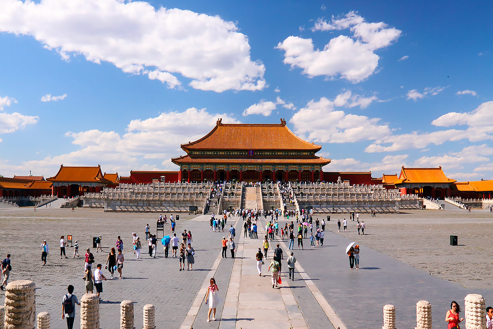

После посещения Шанхая я отправился в Пекин, чтобы изучить его знаменитые достопримечательности. В первую очередь я решил посетить Запретный город, известный своим богатым историческим наследием и архитектурой. Прогуливаясь по его территории, я ощутил атмосферу древности и величия китайской культуры.

Далее я отправился в Храм Неба, который славится своей красотой и гармоничным сочетанием природы и архитектуры. Здесь я наблюдал за церемониями поклонения небу, которые проводятся каждый год.
Следующим пунктом моего маршрута стал Летний дворец, расположенный на окраине Пекина. Этот парк поражает своей красотой и разнообразием ландшафтов, здесь можно отдохнуть от городской суеты и насладиться природой.

Также я посетил Великую китайскую стену, которая является символом могущества и величия китайской цивилизации. Прогулка по этому грандиозному сооружению позволила мне ощутить масштаб и величие этого исторического памятника.

В свободное время я изучал местные рынки и магазины, где приобрёл сувениры и подарки для своих близких.
В заключение своего визита в Пекин я посетил площадь Тяньаньмэнь, где находится мавзолей Мао Цзэдуна и другие важные исторические объекты. Здесь я ощутил дух китайской нации и понял, насколько важно сохранять и уважать свою историю.

Моё путешествие в Пекин оставило неизгладимые впечатления и позволило мне глубже погрузиться в культуру и историю Китая.

