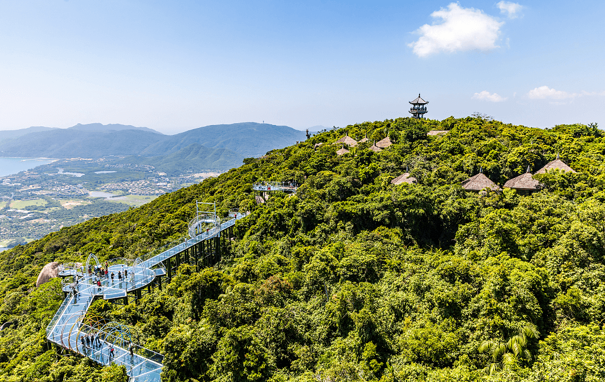

После посещения Пекина я отправился в Чунцин, чтобы провести там последнюю неделю своего путешествия. Чунцин — это крупный город в западном Китае, известный своей экономикой, промышленностью и достопримечательностями.
Первым делом я решил посетить старый город Лунъянь, который находится на берегу реки Цзялин. Здесь я увидел множество исторических зданий, построенных ещё во времена династий Мин и Цин. В этом районе также расположены ремесленные лавки и сувенирные магазины.

Далее я отправился на прогулку по парку Цзефан Бэй, который является сердцем деловой и туристической жизни города. Здесь я смог насладиться красивыми видами на город.

Вечером я решил прокатиться на канатной дороге через реку Янцзы, которая является одной из главных достопримечательностей Чунцина. С высоты птичьего полёта я смог насладиться потрясающими пейзажами ночного города и его огнями.
Кроме того, я посетил зоопарк Чунцина, который является одним из крупнейших зоопарков в Китае. Здесь я увидел множество разнообразных животных, в том числе панд, которые считаются символом Китая.

В общем, моя последняя неделя в Чунцине была полна ярких впечатлений и эмоций. Я смог познакомиться с историей, культурой и природой этого удивительного города.

